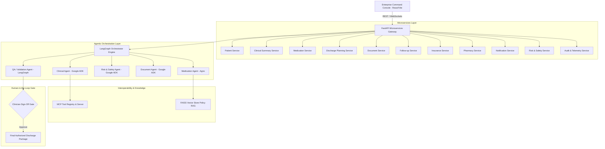

# High Level Design (HLD) — CareFlow AI Platform

## 1. System Architecture Diagram

## 2. Key Architectural Guarantees
- **Safety**: AI NEVER autonomously authorizes medical discharge.
- **Auditability**: Every agent execution, tool call, and decision generates an immutable telemetry trace.
- **Grounding**: RAG policy retrieval provides explicit citations for clinical recommendations.
